# 新员工入职分享：AI 工具、Agent 与 Vibe Coding 工程实践

> **分享时长**：约 20 分钟  
> **分享人**：李文健  
> **日期**：2026-06-12  

---

## 分享大纲（20 分钟）

| 环节 | 时长 | 内容 |
|------|------|------|
| 1. 开场 | 2 min | 分享背景与三个项目概览 |
| 2. 工作方式 | 5 min | Vibe Coding、工具链、Agent 体系 |
| 3. AI Gateway | 4 min | 企业级 AI 基础设施 |
| 4. cc-go | 4 min | Claude Code 远程编码 |
| 5. codex-go | 4 min | Codex 远程编码 |
| 6. 收尾 | 1 min | 访问申请、上手建议 |

---

## 1. 开场（2 min）

大家好，这次分享主要聊三件事：

1. 我日常怎么用 AI 工具做完整系统
2. 怎么用 Agent / Skills / Subagent 固化重复工作
3. 怎么用 Vibe Coding 把「描述意图 → 验证结果」跑成固定节奏

近期参与的三套系统如下：

| 项目 | 定位 | GitHub | 演示地址 |
|------|------|--------|----------|
| **AI Gateway** | 企业级多租户 AI API 治理平台 | https://github.com/QEDQCD/ai_gateway | http://8.162.21.158:31873 |
| **cc-go** | 微信远程接管 Claude Code | https://github.com/QEDQCD/cc-go | http://8.162.21.158:18080 |
| **codex-go** | 微信远程接管 Codex | https://github.com/QEDQCD/codex-go | http://8.162.21.158:44262 |

> **访问说明**：以上演示地址已配置安全组规则，采用 IP 白名单限制。需要访问的同学，请提前申请放行公网 IP。

---

## 2. 我的工作方式：Vibe Coding + 工具 + Agent（5 min）

### 2.1 Vibe Coding 怎么理解

Vibe Coding 是一种 **意图驱动、快速迭代、持续验证** 的研发方式，流程大致如下：

```
明确目标 → 描述上下文 → AI 生成/修改代码 → 验证行为 → 纠偏 → 再验证
```

和常见做法的差异：

| 常见做法 | Vibe Coding |
|----------|-------------|
| 先写详细设计，再动手 | 先跑通最小路径，再补边界 |
| 人工查文档、搜资料 | 让 Agent 读代码库、查项目约定 |
| 重复脚手架手写 | Skills / 模板 / 子 Agent 执行 |
| 本地 IDE 单点开发 | 桌面 + 手机 + 统一 API 网关协同 |

我平时的习惯：

- 人定方向和验收标准，AI 负责展开和试错
- 小步提交，优先保证可运行
- 重复流程写成 Skill，避免每次重新写 prompt

### 2.2 工具矩阵

```mermaid
flowchart LR
    subgraph 编码 Agent
        CC[Claude Code]
        CX[Codex]
        CR[Cursor]
    end

    subgraph 远程桥接
        CCGO[cc-go]
        CXGO[codex-go]
    end

    subgraph 基础设施
        GW[AI Gateway]
    end

    subgraph 协同通道
        WX[微信 Bot]
        WEB[Web 管理台]
    end

    CC --> CCGO
    CX --> CXGO
    CR --> CC
    CR --> CX
    CCGO --> WX
    CXGO --> WX
    CCGO --> WEB
    CXGO --> WEB
    CC --> GW
    CX --> GW
    CR --> GW
```

| 层级 | 工具/系统 | 作用 |
|------|----------|------|
| 编码 Agent | Claude Code、Codex、Cursor | 读代码、改代码、跑命令、写测试 |
| 能力扩展 | Skills、Plugins、Subagents | 固化流程、规范、检查清单 |
| 远程桥接 | cc-go / codex-go | 手机审批权限、切换会话、收推送 |
| 基础设施 | AI Gateway | 统一模型入口、租户治理、审计与成本 |

### 2.3 Agent 的三层分工

项目里我把 Agent 分成三类：

#### A. 主 Agent（对话入口）

- Claude Code / Codex / Cursor 的主会话
- 理解需求、规划步骤、调用工具

#### B. Skills（按需加载的能力包）

Skills 只在相关场景加载，避免长文档常驻上下文。

典型结构：

```text
my-skill/
├── SKILL.md        # 入口说明（必需）
├── template.md     # 输出模板
├── examples/       # 示例
└── scripts/        # 可执行脚本
```

cc-go / codex-go 支持 **Skills 自动注入**：会话启动前写入项目 `.claude/skills/` 或 `.codex/skills/`，Agent 能直接识别项目级能力。

#### C. Subagent（并行/隔离执行）

适合这些场景：

- 大范围代码探索
- 独立子任务（只跑测试、只查某个模块）
- 减少主会话上下文污染

### 2.4 一个实际例子：微信通知

以「Claude 完成关键步骤后，通过微信推送摘要」为例：

1. 描述需求
2. Agent 读现有 bridge / wechat 模块
3. 生成 `wechat-notify` Skill，写入项目 skills 目录
4. cc-go 在会话启动时自动注入
5. 验证：手机收到推送，Web 面板状态正确
6. 补文档和配置，后续会话自动生效

这个流程的价值在于：成功经验能沉淀成系统能力，后续直接复用。

---

## 3. 项目一：AI Gateway（4 min）

- **GitHub**：https://github.com/QEDQCD/ai_gateway
- **演示地址**：http://8.162.21.158:31873（需申请 IP 白名单）

### 3.1 背景

团队接入大模型时，常见几个问题：

- 各自申请上游 Key，缺少统一治理
- 调用量、费用、失败率看不清楚
- 多模型切换成本高
- 上游凭据容易散落

AI Gateway 把流程收敛成一条线：

```
账号申请 → Admin 审批 → 开通租户 → Member 创建平台 API Key → 统一调用 → 审计与计费
```

### 3.2 核心能力

| 模块 | 能力 |
|------|------|
| 租户治理 | 多租户隔离、账号申请审批、配额与账单 |
| API Key 生命周期 | 创建、轮换、停用、脱敏展示 |
| 模型路由 | 快模型（Qwen Flash）/ 强模型（MIMO）按规则切换 |
| 调用观测 | 实时总览、调用明细、Token 与成本统计 |
| 审计安全 | 上游 Key 不暴露、操作留痕、IP 白名单 |

### 3.3 界面预览

**总览**

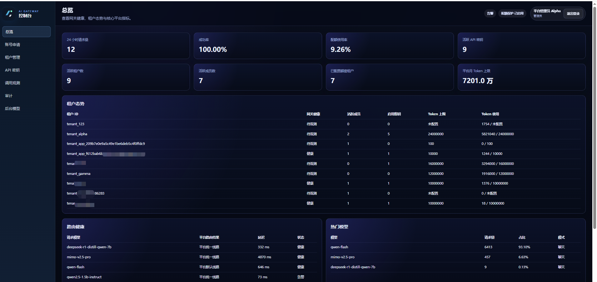

**API Key 管理**

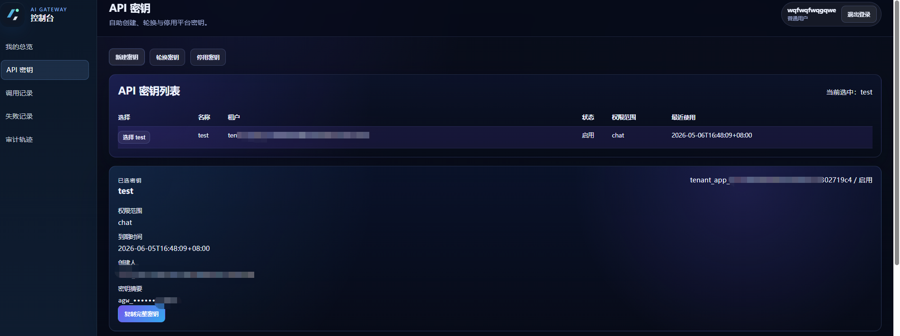

**调用明细与模型健康**

<p>
  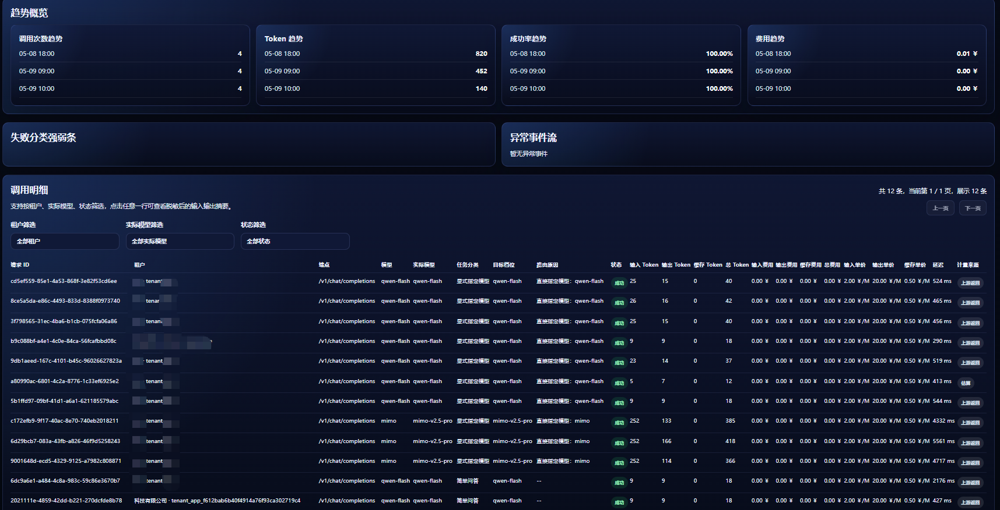
  
</p>

### 3.4 技术栈

```text
ai_gateway/
├── gateway/        # Go 核心网关（鉴权、路由、审计）
├── web/            # React 中文控制台
├── rag-service/    # 内部检索支撑（容器内网）
├── model-service/  # 模型服务扩展层
└── deploy/         # Docker Compose 编排
```

依赖：PostgreSQL、Redis、RabbitMQ

### 3.5 和其他工具的关系

AI Gateway 作为统一模型出口：

- Claude Code / Codex / Cursor 都可通过平台 Key 调用
- 编码类请求可路由到强模型
- 调用可追踪、可计费、可审计

---

## 4. 项目二：cc-go（4 min）

- **GitHub**：https://github.com/QEDQCD/cc-go
- **演示地址**：http://8.162.21.158:18080（需申请 IP 白名单）

### 4.1 背景

Claude Code 能力够强，但有两个实际限制：

1. 工具权限审批通常要在电脑前完成
2. 会话状态绑定本地终端，移动端不方便

cc-go 的做法：在服务器上跑 Claude Code，通过手机微信或 Web 面板远程接管。

### 4.2 系统架构

```text
┌─────────────┐     HTTP/WS      ┌──────────────┐    stdin/stdout    ┌────────────┐
│  微信客户端   │ ◄──────────────► │   cc-go      │ ◄────────────────► │ Claude Code │
│  (手机)      │                  │  (Web + Bot)  │   stream-json     │ (CLI 进程)   │
└─────────────┘                  └──────┬───────┘                    └────────────┘
                                        │
                                        ▼
                                 ┌──────────────┐
                                 │  Web 管理界面   │
                                 │  (React SPA)  │
                                 └──────────────┘
```

### 4.3 核心功能

| 功能 | 说明 |
|------|------|
| 微信远程控制 | `/sessions`、`/switch`、`/stop` 等指令管理会话 |
| 权限审批 | 手机端 `/y` 批准、`/n` 拒绝、`/r` 回答问题 |
| 实时推送 | AI 回复、工具调用、权限请求推送到微信 |
| Web 管理台 | 仪表盘、会话列表、实时聊天、日志、设置 |
| Skills 注入 | 启动前自动写入 `.claude/skills/` |
| Bot API | 外部系统可通过 HTTP 发微信消息 |

### 4.4 界面预览

**Web 仪表盘**

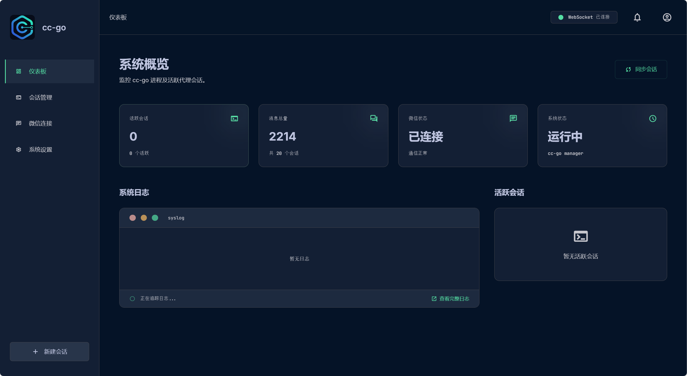

**手机微信对话**

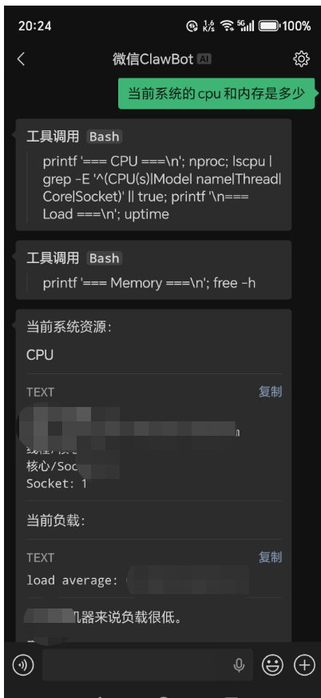

**Skills 管理**

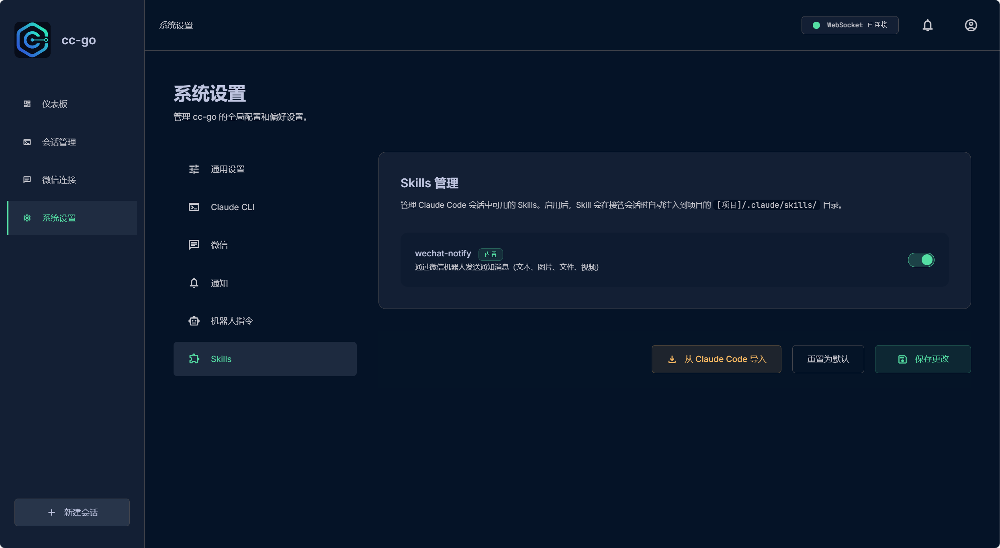

### 4.5 典型场景

| 场景 | 操作 |
|------|------|
| 通勤路上 | 微信收到权限请求 → `/y` 批准 → Claude 继续执行 |
| 会议间隙 | `/status` 看进度，`/sessions` 切换任务 |
| 多人协作 | Web 面板查看会话历史与日志 |
| 自动化通知 | 项目脚本调用 Bot API 推送构建结果 |

### 4.6 实际收益

- Agent 在服务器上持续工作
- 通过手机处理关键审批
- Skills 保证项目有统一工程规范

---

## 5. 项目三：codex-go（4 min）

- **GitHub**：https://github.com/QEDQCD/codex-go
- **演示地址**：http://8.162.21.158:44262（需申请 IP 白名单）

### 5.1 和 cc-go 的关系

codex-go 和 cc-go 架构同源，内核不同：

| 对比项 | cc-go | codex-go |
|--------|-------|----------|
| 内核 | Claude Code | Codex |
| 协议 | stream-json | JSON-RPC / stream-json |
| Skills 目录 | `.claude/skills/` | `.codex/skills/` |
| 适用场景 | Anthropic 生态、长上下文推理 | OpenAI Codex 生态、App Server 集成 |

做两个版本的原因：

- 不同任务适合不同 Agent
- 远程桥接层可复用，换内核即可
- 按场景选工具，减少绑定单一产品

### 5.2 核心功能

和 cc-go 对齐：

- 微信远程控制与会话管理
- 权限审批与实时推送
- Web 管理面板
- Skills 自动注入
- Bot API 对外发消息

### 5.3 界面预览

**Web 仪表盘**

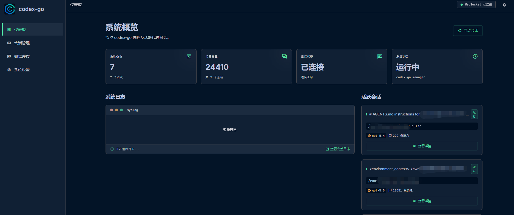

**微信会话**

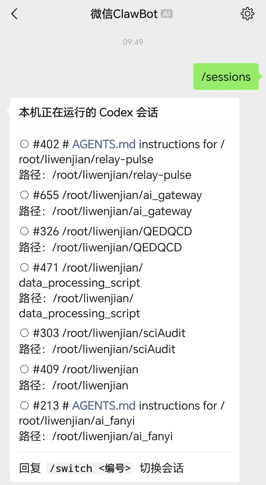

**Skills 管理**

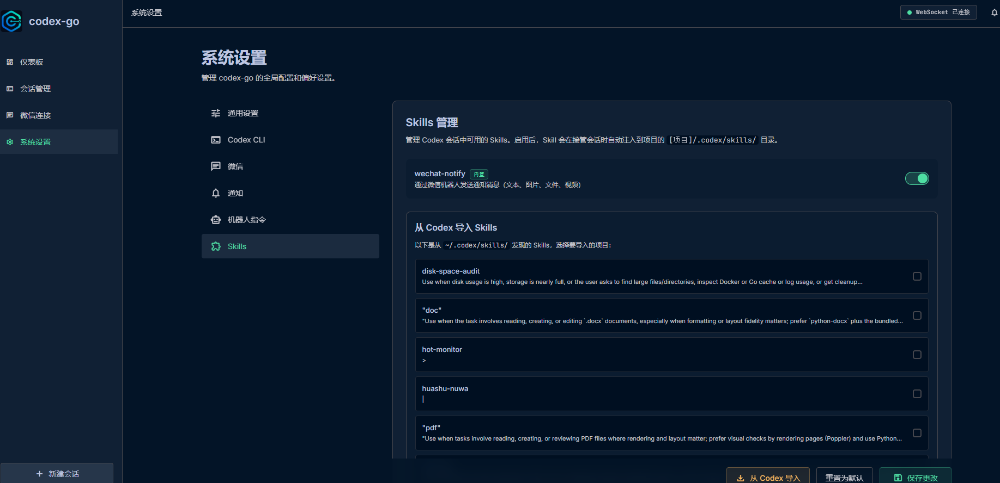

### 5.4 Codex Skills

Codex Skills 遵循 [Agent Skills 开放标准](https://agentskills.io/)，主要能力：

| 能力 | 说明 |
|------|------|
| 按需加载 | 长参考文档不占用常驻上下文 |
| `/skill-name` 显式调用 | 流程变成可重复命令 |
| Subagent 执行 | 复杂任务隔离运行 |
| 动态上下文注入 | 如自动拉取 git diff |

把固定做法写成 Skill，后续直接调用，减少重复说明。

---

## 6. 三项目协同关系

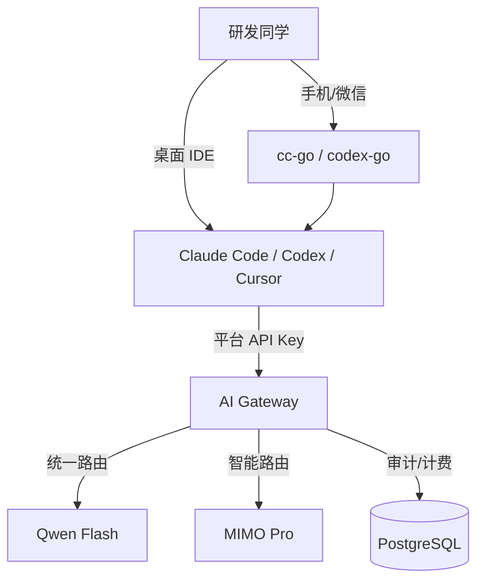

分工：

- **AI Gateway**：模型接入与治理
- **cc-go / codex-go**：远程操控与移动协同
- **Skills / Subagents**：工程经验沉淀
- **Vibe Coding**：把上面几层串进日常开发流程

---


---

## 附录

### A. 项目仓库

| 项目 | GitHub | 说明 |
|------|--------|------|
| ai_gateway | https://github.com/QEDQCD/ai_gateway | 企业级 AI API 治理平台 |
| cc-go | https://github.com/QEDQCD/cc-go | Claude Code 微信远程桥接 |
| codex-go | https://github.com/QEDQCD/codex-go | Codex 微信远程桥接 |

### B. 关键文档

- AI Gateway：`ai_gateway/README.md`、`ai_gateway/当前功能与技术概览.md`
- cc-go：`cc-go/README.md`、`cc-go/docs/插件参考.md`
- codex-go：`codex-go/README.md`、`codex-go/docs/使用 skills 扩展 Codex.md`

### C. 常见问题

| 问题 | 回答 |
|------|------|
| Vibe Coding 会降低代码质量吗？ | 质量仍靠验收、测试和 Code Review，工具本身不替代这些环节 |
| 为什么做 cc-go 和 codex-go 两个？ | 内核不同、场景不同，桥接层和 Gateway 已统一 |
| 安全怎么控制？ | Gateway 隐藏上游 Key；演示环境有 IP 白名单；权限审批可追溯 |
| 使用需要会 Go/React 吗？ | 日常使用不需要；二次开发需要对应技术栈 |

---
